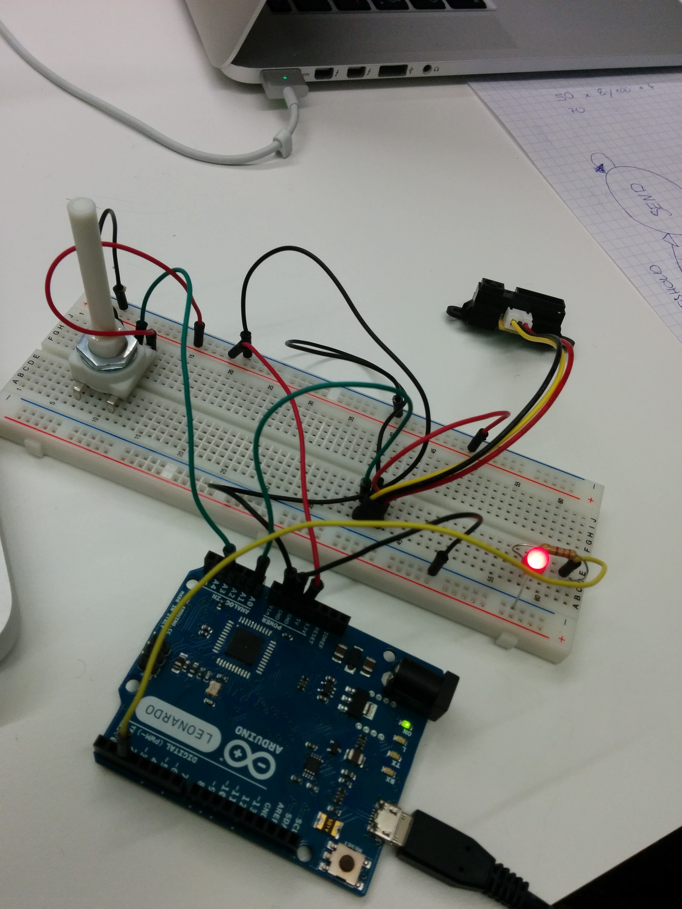
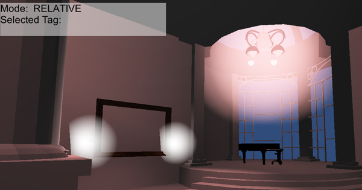
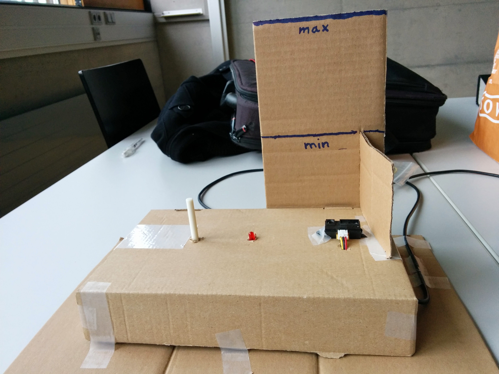

# Projekt: Buzz Lightning

+ Idee
	+ Kriterien
+ Umsetzung
	+ Controlleraufbau 
	+ Software
	+ 3D-Modelle
+ Ergebnis
+ Anwendung

## Idee

Die Idee für unser Projekt ist eine Lichtsteuerung, mit der man die Intensität mehrerer Lichtquellen mit Hilfe eines Distanzsensors regeln kann.

Dabei soll zwischen zwei Modis unterschieden werden:

+ Steuerung der Intensität mit absoluten Werten
+ Steuerung der Intensität relativ zu aktuellem Wert

Außerdem wollen wir mit einem Drehpotentiometer zwischen mehreren Lichtern auswählen können.

Als Szenario haben wir eine reale Situation gewählt: Die Beleuchtung einer Wohnung mit mehreren Lichter. Jedoch haben wir dieses Szenario etwas verändert, damit die Lichtsteurung besser wahrnehmbar ist: 

+ Überflüssige Texturen werden weggelassen
+ Es gibt keine Lichteinflüsse von außen
+ Die Lichter sind in einem rötlichen Farbton

### Kriterien
Wir haben uns folgende Kriterien gesetzt die wir mit Buzz Lightning erreichen und erfüllen wollen. Dies gibt auch einen kleinen Ausblick bzw. Begründung für die weiter folgenden Schritte während der Entwicklung. 

+ Einfachheit der Bedienung
	+ Anwender soll verschiedene Lichtquellen schnell anpassen und steuern können
	+ Ungewollte Angaben abfangen durch ein definiertes Start und Ende der Eingabe
+ Umsetzung der Lichtsteuerung
	+ keine Sprunghafte Änderung des Lichtes
	+ Natürliches Verhalten von Bewegung zu Steuerung des Lichtes
+ Verständlichkeit für Anwender 
	+ Ist das eigentliche Bedienkonzept verständlich?
	+ Wirkungsverhalten verständlich? Was passiert bei einem bestimmten Eingabeverhalten?
	+ Schnelle Änderungen durch schnellere Bewegungen
+ Praxisbezug
	+ Gibt es Anwendungsgebiete in der diese Steuerung klare Vorteile gegenüber einer herkömmlichen Steuerung hat? 

## Umsetzung

### Controlleraufbau

Zur Eingabe werden ein Distanzsensor und ein Drehpotentiometer verwendet.
Diese werden wie in folgenden Grafiken an einen Arduiono Leonardo angeschlossen, der die Steuerung übernimmt. Zur Anzeige des Lock-Zustandes wurde eine rote LED angeschlossen.





### Software

#### Arduino

Der Arduino regelt die Eingabewerte und übermittelt diese über den Seriellen Ausgang an unsere Software.

Dabei werden zuerst noch die Werte des Distanzsensors auf einen bestimmten Wertebereich eingeschränkt und geglättet. Außerdem werden die Werte immer nur dann übermittelt, wenn sie einen bestimmten, vorher festgelegten Grenzwert überschreiten.

```c
// read the input on distance sensor and potentiometer
int gesamtSumme = gesamtSumme - messungen[zeiger]; // substrahiere letzte Messung
int readDistValue = analogRead(distSensor);
if(readDistValue < 350) readDistValue = 350;
if(readDistValue > 650) readDistValue = 650;

messungen[zeiger] = map(readDistValue, 350, 650, 0, 100); 
gesamtSumme = gesamtSumme + messungen[zeiger]; // addiere Wert zur zeiger = zeiger + 1; // zur naechsten Position im Array                
if (zeiger >= anzahlMessungen) // wenn Ende des Arrays erreicht ... zurueck zum Anfang
{
	// Save last value
	prevValue = currentValue;
	zeiger = 0;
}
    
currentValue = gesamtSumme / anzahlMessungen;
```

Außerdem war es uns wichtig, dass wir erkennen können ob die Eingabe gewollt oder ungewollt erfolgt ist.

Um die Änderungen zu unterscheiden können, haben wir uns für ein Lock-Out System entschieden. Der AnwenderInnen können die Regelung beenden, sobald sie kurz in einer Position verharren. Das System sperrt dann diese Position für einige Sekunden bevor weitere Änderungen übernommen werden können.

Dafür verwenden wir eine Finite State Machine mit drei Zuständen.

```cpp
#include <FiniteStateMachine.h>

State Wait = State(Waiting);
State Send = State(Sending);
State Lock = State(Locking);
```


Wie oben zu sehen ist, reagiert der Controller auf die Werte des Distanzsensors. Erst wenn eine Veränderung der Werte erkannt wird, geht das Gerät in den Sende-Zustand und sendet die geglätteten Werte des Distanzsensors - sowohl die relativen (d.h. Deltawerte in Bezug auf die zuletzt gesendeten Werte) als auch die absoluten Werte.

Sobald keine Veränderung der Werte für eine vorher definierte Anzahl an Messungen festgestellt wird - geht der Controller in den Lock-Zustand. Hier wird auf keine Messung mehr reagiert. Dieser Modus wird mithilfe der roten LED gekennzeichnet.

Nach zwei Sekunden geht der Controller wieder in den Warte-Zustand.

#### Java Serial2UDP

Aufgrund von Problemen mit Mono und der Seriellen Schnittstelle unter OSX haben wir ein Java Programm verwendet, dass die Seriellen Schnittstellen überwacht und sämtlichen Werte über UDP an unsere Unitysoftware weiterleitet.

#### Unity

Unser Unity Programm besteht aus zwei Tweilen: Einem UDP-Empfänger und einem Lichtcontroller.

##### UDP Empfänger
Der UDP Empfänger hört auf den UDP-Eingabeport und leitet die empfangenen Daten an den Lichtcontroller weiter. Zwischen dem Absoluten und dem Relativen Modus entscheidet der Lichtkontroller - der Receive Data Controller bekommt aber beide Werte vom Arduino und muss die benötigten Daten weiterleiten.

```c#
private void ReceiveData() {
	client = new UdpClient(port);
	while (true)
	{
		try
		{
			// Bytes empfangen.
			IPEndPoint anyIP = new IPEndPoint(IPAddress.Any, 0);
			byte[] data = client.Receive(ref anyIP);
				
			// Bytes mit der UTF8-Kodierung in das Textformat kodieren.
			string text = Encoding.UTF8.GetString(data);
			
			// Potentiometer
			if (text.Contains("p")) {
				int serial = Convert.ToInt32(text.Substring(1));
				print(">> PotValue: " + serial);

				tag = lightController.serialToTag(serial);
				print (">> tag: " + tag);	
			}

			// Absolute Distance: d
			if (!lightController.RelativeMode && text.Contains("d")) {
				int serial = Convert.ToInt32(text.Substring(1));
				float intensity = 0;
				print(">> DistValue: " + serial);			

				intensity = lightController.serialToIntensity(serial);
				print(" >> Intensity: " + intensity);
				lightController.setLightIntensity(tag, intensity);
			// Relative Distance: g
			} else if ( lightController.RelativeMode && text.Contains("g")) {
				int serial = Convert.ToInt32(text.Substring(1));
				float intensity = 0;
				print(">> Relative Value: " + serial);

				intensity = lightController.serialToIntensity(serial);
				lightController.setLightIntensity(tag, intensity);
			}
		}
		catch (Exception err)
		{
			print(err.ToString());
		}
	}
}
```

##### Light Controller

Der Light Controller kennt alle Lichter und wandelt die Seriellen Werte in verarbeitbare Daten (d.h. Intensitäten) um.

Das bedeutet er übernimmt die Steuerung des Lichtes in dem er die Werte des Potentiometers umrechnet und ein Licht anwählt.

Die Lichtintensität wird ebenfalls anhand von Eingabedaten berechnet. Dabei wird der Sensorwert des Distanzsensors in Lichtintensität umgerechnet. Folgende Formel wird hierfür verwendet:

`Intensity = Sensor_Value * (INTENSITY_MAX / SENSOR_MAX)`

Im relativen Modus funktioniert das gleich, jedoch haben wir einen geringen Intensitätsbereich - der auch in den negativen Bereich gehen kann.

Für die Steuerung stehen daher vier Funktionen zur Verfügung:
+ **serialToTag** - rechnet den Sensorwert in einen Lichttag um für die Auswahl der Lichter
+ **serialToIntensity** - rechnet den Sensorwert in eine Intensität um
+ **setLightIntensity** - setzt die Intensität der Lichter mit dem Tag

```c#
/**
 * Returns the Tag for the light by the serial port mapping
 */
private String last_tag = "";
public String serialToTag(int serial) {
	int index = 0;
	
	index += Math.Max(0,  Math.Min (light_map.Count - 1, serial * light_map.Count / SERIAL_MAX));

	// Get the tag
	String tag = tag_list [index];

	if ( last_tag != tag) {
		changeLight (tag);	
	}
	last_tag = tag;
	

	// Return the tag
	return tag;
}

/**
 * Returns the intensity for the serial value
 */
public float serialToIntensity(int serial) {
	if (RelativeMode == false) {
		serial = Math.Max (SERIAL_MIN, Math.Min (serial, SERIAL_MAX));

		float intensity = serial * (INTENSITY_MAX / SERIAL_MAX);
		// Inverse dine mama (the intensity)
		intensity = INTENSITY_MAX - intensity;

		return Math.Max (INTENSITY_MIN, Math.Min (intensity, INTENSITY_MAX));
	} else {
		float maxDeltaIntensity = (INTENSITY_MAX - INTENSITY_MIN) / 4;
		
		float intensity = serial * (maxDeltaIntensity / SERIAL_DELTA_MAX);
		
		return Math.Max (-maxDeltaIntensity, Math.Min (intensity, maxDeltaIntensity));
	}
}
	
/**
 * Set the light intensity
 */
public void setLightIntensity(String light_tag, float intensity) {
	if (light_tag != "") {
		if (RelativeMode == false) {
			Change change = new Change ();
			change.Tag = light_tag;
			change.Intensity = intensity;

			changes.Enqueue (change);
		} else {
			Change change = new Change ();
			change.Tag = light_tag;
			change.Intensity = Math.Max (INTENSITY_MIN, Math.Min (intensity_map [light_tag] + intensity, INTENSITY_MAX));

			changes.Enqueue (change);
		}
	}
}
```

Wie oben zu sehen ist, werden die Änderungen nicht direkt übernommen sondern in eine Changes-Queue gespeichert.
Diese Queue wird dann innerhalb der Update Funktion abgeabeitet.

Dies wird gemacht, da die Intensitäten der Objekte nur innerhalb des Main-Threads verändert werden dürfen - durch den UDP Receiver jedoch ein anderer Thread läuft.

```c#
public void Update() {
	// If there are changes to do, do it..
	if (changes.Count > 0) 
	{
		Change change = changes.Dequeue();

		print("Change: Tag = " + change.Tag + "; Intensity = " + change.Intensity);

		// Save previous intensity (only if there is really a change in the intensity)
		if ( change.Intensity != intensity_map[change.Tag] && intensity_map[change.Tag] != 0)
			intensity_map_prev[change.Tag] = intensity_map[change.Tag];

		// Change the light intensities
		foreach(Light light in light_map[change.Tag] ) {
			light.intensity = Math.Max(INTENSITY_MIN, Math.Min(INTENSITY_MAX, change.Intensity));
		}
		intensity_map[change.Tag] = change.Intensity;
	}
}
```

### 3D-Modelle
Nachdem der erste Prototyp direkt in Unity erstellt wurde, sodass die Eingabegeräte mit Lichtern getestet werden konnten, wurde über ein mögliches Szenario überlegt. Die Entscheidung fiel auf eine komplette Wohnungsszene.  
Es wurde abgeklärt, dass es möglich ist, eine Szene aus dem Internet zu nutzen. Daher wurde diese [Vorlage](http://www.cgtrader.com/free-3d-models/architectural-interior/office-commercial/steampunk-office) gefunden.

Aufbauend darauf, wurde die Szene im Maya noch bearbeitet und einige Objekte *reversed*, sodass die Oberfläche auf beiden Seiten in Unity sichtbar sind. Nach dem Export von Maya und dem Import in Unity, wurden die Lichter, Leuchtungseffekte und einige Texturen hinzugefügt.



Wichtig sind die sogenannten "Collider" in Unity. Wenn diese bei bestimmten Objekten nicht hinzugefügt werden, kann sich der "CharacterController" durch die Objekte hindurch bewegen bzw. fallen. Bei vorgefertigten Models könnten deshalb Problem, entstehen, wenn Objekte gruppiert wurden. Bei gruppierten Objekten, kann zwar der "Collider" hinzugefügt werden, jedoch sind die Kollisionskanten nicht am Objekt anliegend und es könnten Probleme beim Bewegen des Charakters entstehen.

## Ergebnis
Wir haben im ersten Schritt unsere eigenen Kriterien bewertet und mit dem Ergebnis des Projektes verglichen und.



### Vor und Nachteile einer absoluten und relativen Steuerung
**Absolute Steuerung**  
+ es gibt pro Steuerungsvorgang nur ein Lock-Zyklus  
+ die Steuerung erlaubt ein leichtes Ein- und Ausschalten der Lichtquelle  
- nur ein begrenzte Genauigkeit beim Dimmen einer Lichtquelle

**Relative Steuerung**  
+ im Gegensatz zur absoluten Steuerung ist durch die Aufteilung in mehrere Schritte der Regulierungsbereich kleiner und somit ist ein genaueres adjustieren möglich   
- erzeugt dadurch aber mehrere Lock-Zyklen pro Steuerungsvorgang und somit längere Wartezeiten für den Anwender   
- Ein- und Ausschalten kann mitunter 3-4 Steuerungszyklen benötigen

### Benutzerakzeptanz
Um die gesetzten Kriterien repräsentativ zu bewerten haben wir einen Versuch mit 10 Personen durchgeführt. Wir haben dazu vor allem die Kriterien in Bezug auf Einfachheit und Verständlichkeit der Anwender betrachtet. Anhand von dessen Reaktionen und Rückmeldungen ist folgende Analyse enstanden. 

**Einfachheit der Bedienung**  
Die Geschwindigkeit der Schaltung ist vor allem im relativen Modus etwas schwerfällig und kann länger dauern als ein gewöhnlicher Dimmer. Im Fall des absoluten Modus sind die Warte-Zwischenschritte nicht nötig. Es braucht auch die Akzeptanz des Anwenders nach eingestellter Helligkeit die Hand nicht einfach wegzuziehen sondern auf den Lock-Modus zu warten. Im Vergleich zu einem Potentiometer ist die Steuerung über einen Abstandssensor auch schwieriger da die ganze Hand bewegt werden muss und so eine genaue adjustierung mitunter nicht möglich ist. Der Mensch besitzt in den Fingerspitzen auch eine bessere Feinmotorik und kann so millimeter-genau den Poti drehen.

**Verständlichkeit**   
Die Schaltung ist nach einer kurzen Erklärung für alle Probanden verständlich und die Logik "verdunkeln durch Nähe" und "erhellen durch Ferne" scheint umgänglich zu sein. Hier ist unsere Varianten im Vergleich zu einem Tast-Dimmer besser da dieser mehrmals gedrückt werden muss bis die Steuerung auf heller bzw. dunkler eingestellt ist.

**Praxisbezug**   
Einige der Probanden sahen die neue Steuerung als spielerei an da sie zwar im ersten Moment einen Wow-Effekt auslößen aber im Alltag eher als störend wirken kann. Gerade bei einem Zimmer in dem nicht mehr als 2 unterschiedlich steuerbare Lichtquellen vorhanden sind ist ein Normaler Dimmer, also eine Art Drehpotentiometer sicher besser. Ein weiterer Punkt ist die Position der Steuerung - im Falle einer Wohnung würde dieser auch an der Stelle eines Normalen Schalters platziert werden. Hierbei stellte sich heraus das der Körper eigentlich in Richtung Raum schaut aber die Hand sich Normal auf die Steuerung vor und zurück bewegen muss (also im Winkel von 90°). Wir stellten fest das dies gar nicht so einfach ist in diesem geraden Winkel zur Wand mit gedrehtem Oberkörper/Körper das Licht zu adjustieren. 


## Anwendung

Wenn der Arduino vollständig nach dem oben stehenden Schaltplan konfiguriert ist, muss der Arduino angesteckt werden. Um Daten auslesen zu können, muss zuvor die Installationsanleitung von "Serial2UDP" durchgearbeitet werden. Danach kann das Programm gestartet werden.

```bash
sudo java Serial2UDP <serialPort=?/dev/cu.usbmodemfd121> <baudRate=?9600> <IPAddress=?127.0.0.1> <Port=?30000>
```

Wenn Daten ausgelesen werden, kann nun das Programm, unter Windows mit *"Buzz.exe"* oder unter Mac mit *"Buzz.dmg"*, gestartet werden.
