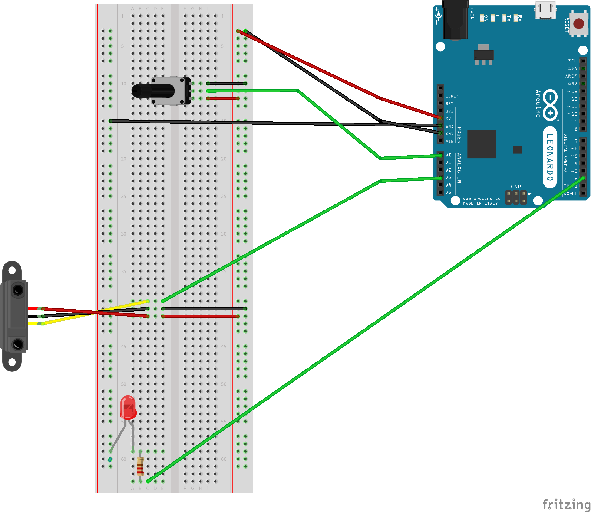
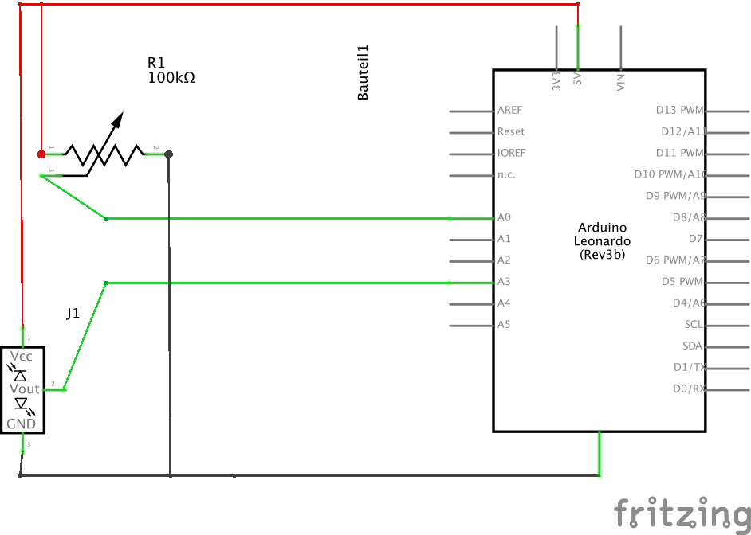
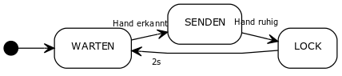

# Projekt: Buzz Lightning

## Idee

Die Idee für unser Projekt ist eine Lichtsteuerung, mit der man die Intensität mehrerer Lichter mithilfe eines Distanzsensors regeln kann.

Dabei soll zwischen zwei Modis unterschieden werden:
+ Steuerung der Intensität mit absoluten Werten
+ Steuerung der Intensität relativ zu aktuellem Wert

Außerdem wollen wir mithilfe eines Drehpotentiometer zwischen mehreren Lichtern auswählen können.

Als Szenario haben wir eine reale Situation gewählt: Die Beleuchtung einer Wohnung mit mehreren Lichter. 
Jedoch haben wir dieses Szenario etwas verändert, damit die Lichtsteurung besser wahrnehmbar ist: 
+ Überflüssige Texturen werden weggelassen
+ Es gibt keine Lichteinflüsse von außen
+ Die Lichter sind in einem rötlichen Farbton

### Kriterien
TODO

## Umsetzung

### Controlleraufbau

Zur Eingabe werden ein Distanzsensor und ein Drehpotentiometer verwendet.
Diese werden wie in folgenden Grafiken an einen Arduiono Leonardo angeschlossen, der die Steuerung übernimmt.





### Software

#### Arduino

Der Arduino regelt die Eingabewerte und übermittelt diese über den Seriellen Ausgang an unsere Software.

Dabei werden zuerst noch die Werte des Distanzsensors auf einen bestimmten Wertebereich eingeschränkt und geglättet. Außerdem werden die Werte immer nur dann übermittelt, wenn sie einen bestimmten, vorher festgelegten Grenzwert überschreiten.

```c
// read the input on distance sensor and potentiometer
int gesamtSumme = gesamtSumme - messungen[zeiger]; // substrahiere letzte Messung
int readDistValue = analogRead(distSensor);
if(readDistValue < 350) readDistValue = 350;
if(readDistValue > 650) readDistValue = 650;

messungen[zeiger] = map(readDistValue, 350, 650, 0, 100); 
gesamtSumme = gesamtSumme + messungen[zeiger]; // addiere Wert zur zeiger = zeiger + 1; // zur naechsten Position im Array                
if (zeiger >= anzahlMessungen) // wenn Ende des Arrays erreicht ... zurueck zum Anfang
{
	// Save last value
	prevValue = currentValue;
	zeiger = 0;
}
    
currentValue = gesamtSumme / anzahlMessungen;
```

Außerdem war es uns wichtig, dass wir erkennen können ob die Eingabe gewollt oder ungewollt erfolgt ist.

Um die Änderungen zu unterscheiden können, haben wir uns für ein Lock-Out System entschieden. Der AnwenderInnen können die Regelung beenden, sobald sie kurz in einer Position verharren. Das System sperrt dann diese Position für einige Sekunden bevor weitere Änderungen übernommen werden können.

Dafür verwenden wir eine Finite State Machine mit drei Zuständen.

```cpp
#include <FiniteStateMachine.h>

State Wait = State(Waiting);
State Send = State(Sending);
State Lock = State(Locking);
```


Wie oben zu sehen ist, reagiert der Controller auf die Werte des Distanzsensors. Erst wenn eine Veränderung der Werte erkannt wird, geht das Gerät in den Sende-Zustand und sendet die geglätteten Werte des Distanzsensors - sowohl die relativen (d.h. Deltawerte in Bezug auf die zuletzt gesendeten Werte) als auch die absoluten Werte.

Sobald keine Veränderung der Werte für eine vorher definierte Anzahl an Messungen festgestellt wird - geht der Controller in den Lock-Zustand. Hier wird auf keine Messung mehr reagiert. Dieser Modus wird mithilfe der roten LED gekennzeichnet.

Nach etwa zwei Sekunden geht der Controller wieder in den Warte-Zustand.

#### Java Serial2UDP

Aufgrund von Problemen mit Mono und der Seriellen Schnittstelle unter OSX haben wir ein Java Programm verwendet, dass die Seriellen Schnittstellen überwacht und sämtlichen Werte über UDP an unsere Unitysoftware weiterleitet.

#### Unity

Unser Unity Programm besteht aus zwei Tweilen: Einem UDP-Empfänger und einem Lichtcontroller.

##### UDP Empfänger
Der UDP Empfänger hört auf den UDP-Eingabeport und leitet die empfangenen Daten an den Lichtcontroller weiter. Zwischen dem Absoluten und dem Relativen Modus entscheidet der Lichtkontroller - der Receive Data Controller bekommt aber beide Werte vom Arduino und muss die benötigten Daten weiterleiten.

```c#
private void ReceiveData() {
	client = new UdpClient(port);
	while (true)
	{
		try
		{
			// Bytes empfangen.
			IPEndPoint anyIP = new IPEndPoint(IPAddress.Any, 0);
			byte[] data = client.Receive(ref anyIP);
				
			// Bytes mit der UTF8-Kodierung in das Textformat kodieren.
			string text = Encoding.UTF8.GetString(data);
			
			// Potentiometer
			if (text.Contains("p")) {
				int serial = Convert.ToInt32(text.Substring(1));
				print(">> PotValue: " + serial);

				tag = lightController.serialToTag(serial);
				print (">> tag: " + tag);	
			}

			// Absolute Distance: d
			if (!lightController.RelativeMode && text.Contains("d")) {
				int serial = Convert.ToInt32(text.Substring(1));
				float intensity = 0;
				print(">> DistValue: " + serial);			

				intensity = lightController.serialToIntensity(serial);
				print(" >> Intensity: " + intensity);
				lightController.setLightIntensity(tag, intensity);
			// Relative Distance: g
			} else if ( lightController.RelativeMode && text.Contains("g")) {
				int serial = Convert.ToInt32(text.Substring(1));
				float intensity = 0;
				print(">> Relative Value: " + serial);

				intensity = lightController.serialToIntensity(serial);
				lightController.setLightIntensity(tag, intensity);
			}
		}
		catch (Exception err)
		{
			print(err.ToString());
		}
	}
}
```

##### Light Controller

Der Light Controller kennt alle Lichter und wandelt die Seriellen Werte in verarbeitbare Daten (d.h. Intensitäten) um.

Das bedeutet er übernimmt die Steuerung des Lichtes in dem er die Werte des Potentiometers umrechnet und ein Licht anwählt.

Die Lichtintensität wird ebenfalls anhand von Eingabedaten berechnet. Dabei wird der Sensorwert des Distanzsensors in Lichtintensität umgerechnet. Folgende Formel wird hierfür verwendet:

`Intensity = Sensor_Value * (INTENSITY_MAX / SENSOR_MAX)`

Im relativen Modus funktioniert das gleich, jedoch haben wir einen geringen Intensitätsbereich - der auch in den negativen Bereich gehen kann.

Für die Steuerung stehen daher vier Funktionen zur Verfügung:
+ **serialToTag** - rechnet den Sensorwert in einen Lichttag um für die Auswahl der Lichter
+ **serialToIntensity** - rechnet den Sensorwert in eine Intensität um
+ **setLightIntensity** - setzt die Intensität der Lichter mit dem Tag

```c#
/**
 * Returns the Tag for the light by the serial port mapping
 */
private String last_tag = "";
public String serialToTag(int serial) {
	int index = 0;
	
	index += Math.Max(0,  Math.Min (light_map.Count - 1, serial * light_map.Count / SERIAL_MAX));

	// Get the tag
	String tag = tag_list [index];

	if ( last_tag != tag) {
		changeLight (tag);	
	}
	last_tag = tag;
	

	// Return the tag
	return tag;
}

/**
 * Returns the intensity for the serial value
 */
public float serialToIntensity(int serial) {
	if (RelativeMode == false) {
		serial = Math.Max (SERIAL_MIN, Math.Min (serial, SERIAL_MAX));

		float intensity = serial * (INTENSITY_MAX / SERIAL_MAX);
		// Inverse dine mama (the intensity)
		intensity = INTENSITY_MAX - intensity;

		return Math.Max (INTENSITY_MIN, Math.Min (intensity, INTENSITY_MAX));
	} else {
		float maxDeltaIntensity = (INTENSITY_MAX - INTENSITY_MIN) / 4;
		
		float intensity = serial * (maxDeltaIntensity / SERIAL_DELTA_MAX);
		
		return Math.Max (-maxDeltaIntensity, Math.Min (intensity, maxDeltaIntensity));
	}
}
	
/**
 * Set the light intensity
 */
public void setLightIntensity(String light_tag, float intensity) {
	if (light_tag != "") {
		if (RelativeMode == false) {
			Change change = new Change ();
			change.Tag = light_tag;
			change.Intensity = intensity;

			changes.Enqueue (change);
		} else {
			Change change = new Change ();
			change.Tag = light_tag;
			change.Intensity = Math.Max (INTENSITY_MIN, Math.Min (intensity_map [light_tag] + intensity, INTENSITY_MAX));

			changes.Enqueue (change);
		}
	}
}
```

Wie oben zu sehen ist, werden die Änderungen nicht direkt übernommen sondern in eine Changes-Queue gespeichert.
Diese Queue wird dann innerhalb der Update Funktion abgeabeitet.

Dies wird gemacht, da die Intensitäten der Objekte nur innerhalb des Main-Threads verändert werden dürfen - durch den UDP Receiver jedoch ein anderer Thread läuft.

```c#
public void Update() {
	// If there are changes to do, do it..
	if (changes.Count > 0) 
	{
		Change change = changes.Dequeue();

		print("Change: Tag = " + change.Tag + "; Intensity = " + change.Intensity);

		// Save previous intensity (only if there is really a change in the intensity)
		if ( change.Intensity != intensity_map[change.Tag] && intensity_map[change.Tag] != 0)
			intensity_map_prev[change.Tag] = intensity_map[change.Tag];

		// Change the light intensities
		foreach(Light light in light_map[change.Tag] ) {
			light.intensity = Math.Max(INTENSITY_MIN, Math.Min(INTENSITY_MAX, change.Intensity));
		}
		intensity_map[change.Tag] = change.Intensity;
	}
}
```

### 3D-Modelle

## Ergebnis