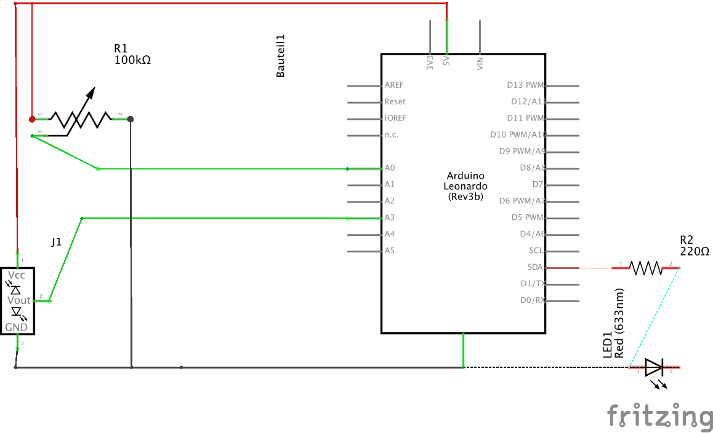

# Projekt Buzzlight

## Idee


## Umsetzung

### Controlleraufbau

Zur Eingabe werden ein Distanzsensor und ein Drehpotentiometer verwendet.
Diese werden wie in folgenden Grafiken an einen Arduiono Leonardo angeschlossen, der die Steuerung übernimmt.




### Software

#### Arduino

Der Arduino regelt die Eingabewerte und übermittelt diese über den Seriellen Ausgang an unsere Software.

Dabei werden zuerst noch die Werte geglättet. Außerdem werden die Werte immer nur dann übermittelt, wenn sie einen bestimmten, vorher festgelegten Grenzwert überschreiten.

```c
//Todo Some Code...
```

#### Java Serial2UDP

Aufgrund von Problemen mit Mono und der Seriellen Schnittstelle unter OSX haben wir ein Java Programm verwendet, dass die Seriellen Schnittstellen überwacht und sämtlichen Werte über UDP an unsere Unitysoftware weiterleitet.

#### Unity

Unser Unity Programm besteht aus zwei Tweilen: Einem UDP-Empfänger und einem Lichtcontroller.

##### UDP Empfänger
Der UDP Empfänger hört auf den UDP-Eingabeport und leitet die empfangenen Daten an den Lichtcontroller weiter.

```c#
private void ReceiveData() {
	client = new UdpClient(port);
	while (true)
	{

		try
		{
			// Bytes empfangen.
			IPEndPoint anyIP = new IPEndPoint(IPAddress.Any, 0);
			byte[] data = client.Receive(ref anyIP);
				
			// Bytes mit der UTF8-Kodierung in das Textformat kodieren.
			string text = Encoding.UTF8.GetString(data);
				
			// Den abgerufenen Text anzeigen.
			print(">> " + text);
				
			// latest UDPpacket
			lastReceivedUDPPacket=text;

			// Set Light Intensity
			//int serial = BitConverter.ToInt32(data, 0);
			//String tag = lightController.serialToTag();
		}
		catch (Exception err)
		{
			print(err.ToString());
		}
	}
}
```

##### Light Controller

Der Light Controller kennt alle Lichter und wandelt die Seriellen Werte in verarbeitbaren Daten um.

Das bedeutet er übernimmt die Steuerung des Lichtes in dem er die Werte des Potentiometers umrechnet und ein Licht anwählt.

Die Lichtintensität wird ebenfalls anhand von Eingabedaten berechnet. Dabei wird der Sensorwert des Distanzsensors in Lichtintensität umgerechnet. Folgende Formel wird hierfür verwendet:

`Intensity = Sensor_Value * (INTENSITY_MAX / SENSOR_MAX)`

Für die Steuerung stehen daher drei Funktionen zur Verfügung:

```c#
/**
 * Returns the Tag for the light by the serial port mapping
 */
public String serialToTag(int serial) {
	return tag_list[0];
}

/**
 * Returns the intensity for the serial value
 */
public float serialToIntensity(int serial) {
	serial = Math.Max (SERIAL_MIN, Math.Min (serial, SERIAL_MAX));

	float intensity = serial * (INTENSITY_MAX / SERIAL_MAX);

	return Math.Max (INTENSITY_MIN, Math.Min (intensity, INTENSITY_MAX));
}
	
/**
 * Set the light intensity
 */
public void setLightIntensity(String light_tag, int intensity) {
	light_map[light_tag].intensity = intensity;
}
```

### Modelle

## Ergebnis